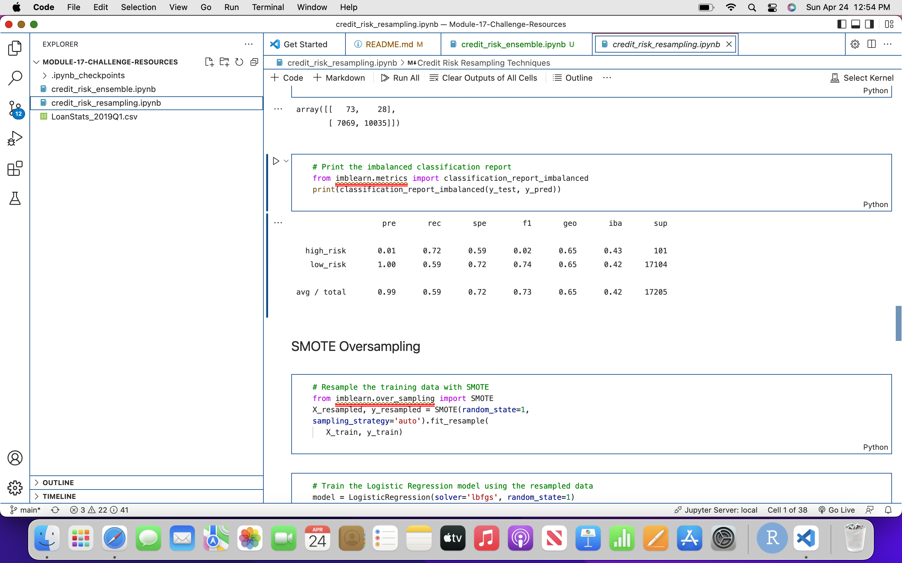
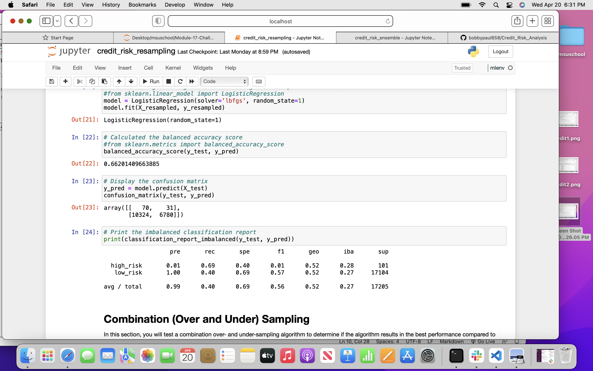
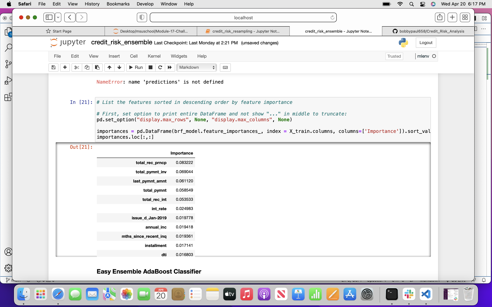
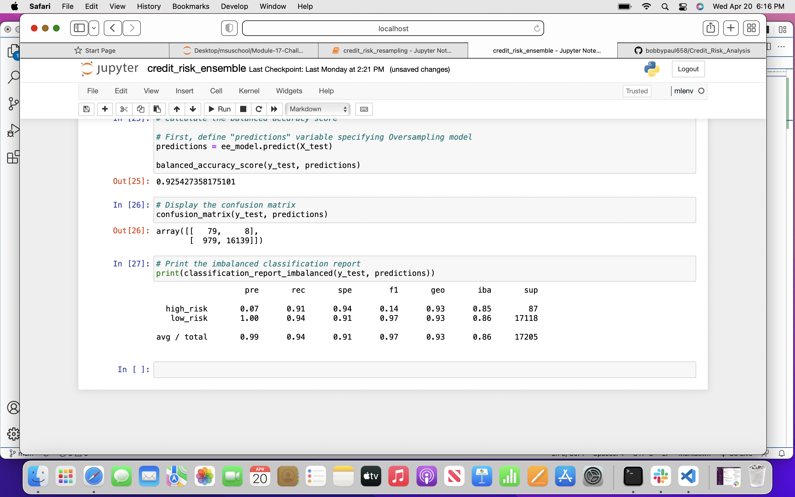
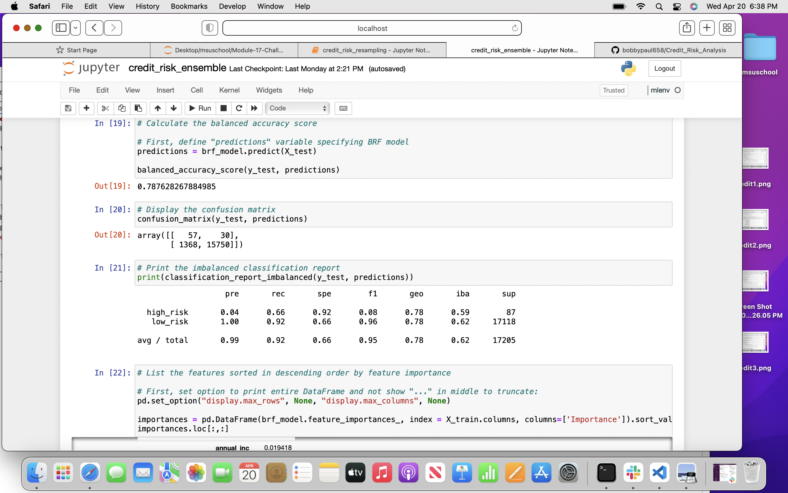

# Credit_Risk_Analysis
#### Purpose: 
Jill is attempting to evaluate models with machine learning to solve a real world channged credit card risk. Jill will attempt to predict credit risk using cluster, imnbalanced learn and cluster centroids.

### Deliverable 
In the random sample model, the balanced accuracy score is 66% as shown below, The high risk preicision is about 1% with 69% sensisitivity. Image is below

model
the balanced accuracy model is 64%
The preicsion is very accurate at 100% nearly

#### Conclusion: 
The easy ensemble classifeid model shows that 93% of high credit risk is detected. I would not recommend the bank use this because low credit along with low precision may make it difficult for the bank to create an effective credit strategy. This may cause the bank to miss business partners or clients that they can use. The ensemble model did show sensity to high credit risk which maybe an effective strategy. Image shown below
